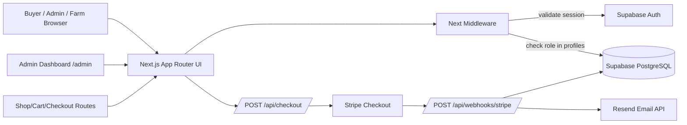

# Bhavnagar Web Application

Bulk fruits and vegetables marketplace built with Next.js App Router, Supabase, Stripe, and Resend. This repository is structured for buyer ordering, admin allocation, farm-owner stock updates, and delivery date coordination.

## Documentation Index

- Technical architecture and implementation: `README.md`
- Application usage guide (buyer/admin/farm-owner): `docs/APPLICATION_USER_GUIDE.md`

## Repository

- GitHub: `https://github.com/mukundsawant1/bhavnagar-commerce-platform`
- Default branch: `master`

## Executive Summary

- Runtime: Next.js 16 (App Router, TypeScript, Tailwind CSS)
- Data platform: Supabase (PostgreSQL + Auth)
- Payments: Stripe Checkout + signed webhook handling (optional; current flow uses admin/farm payment tracking instead of mandatory Stripe payments)
- Notifications: Resend transactional email integration
- Deployment target: Vercel (Hobby-compatible)

## Technical Architecture



## Requirement Coverage Matrix

| Requirement | Implementation |
| --- | --- |
| Fast and responsive web application | Next.js App Router SSR/SSG model with Tailwind responsive UI |
| Gmail-based login and role-based access | Supabase Auth + Gmail-only UI validation + `/admin` and `/farm` role guards in `middleware.ts` |
| Product and order management foundation | Route and API scaffolds for shop/cart/checkout/admin/farm, with cart persistence and Supabase-backed order creation |
| Payment processing | Optional Stripe checkout session API (`/api/checkout`) + admin/farm payment tracking (via `/api/orders` and metadata) |
| Payment status updates | Admin/farm can mark payment received, and webhook updates `orders.status` when Stripe is used |
| Email notifications | Resend integration triggered on payment confirmation |
| Analytics and reporting | Admin dashboard with sales/product performance scaffolds |
| Low-cost hosting | Vercel-ready deployment model |

## Implemented Modules

- UI routes:
	- `/`
	- `/shop`
	- `/cart`
	- `/checkout`
	- `/account`
	- `/admin` (protected, admin role)
	- `/farm` (protected, farm_owner role)
- Middleware:
	- Supabase session validation
	- Admin and farm-owner role checks using `profiles.role`
- APIs:
	- `POST /api/checkout`
	- `POST /api/webhooks/stripe`
- Integrations:
	- `src/lib/supabase/client.ts` (public client)
	- `src/lib/supabase/admin.ts` (service-role client)
	- `src/lib/payments/stripe.ts`
	- `src/lib/notifications/email.ts`
- Auth UI:
	- `src/components/auth/account-auth-panel.tsx`

## UI/UX Direction

- Professional ecommerce shell with sticky multi-row header and searchable navigation
- Conversion-focused landing page with featured offers and trust signals
- Marketplace-style product cards on `/shop` with ratings and merchandising badges
- Structured cart and checkout experiences with order summary side panels
- Responsive layouts tuned for mobile, tablet, and desktop breakpoints

This front-end is optimized to feel familiar to users of top ecommerce platforms while remaining fully custom and brandable.

## Latest Updates (March 2026)

- Brand updated from `Jadiyo` to `Bhavnagar` across UI, API defaults, env template, migration comments, and documentation.
- Order metadata is now stored compressed (gzip + base64) to reduce Supabase storage usage; the app transparently decompresses on read.
- Professional ecommerce UI refresh:
	- sticky top navigation and global search shell
	- polished homepage hero and conversion sections
	- upgraded product cards with ratings, badges, and actions
	- structured cart and checkout layouts with side summaries
	- refined account/admin visual design language
- Project published to GitHub and ready for Vercel import.

## Environment Configuration

Create `.env.local` from `.env.example`:

```bash
NEXT_PUBLIC_SUPABASE_URL=
NEXT_PUBLIC_SUPABASE_ANON_KEY=
# (optional) Some Supabase projects provide a publishable default key instead of anon key. The app will use this if ANON is missing.
NEXT_PUBLIC_SUPABASE_PUBLISHABLE_DEFAULT_KEY=
SUPABASE_SERVICE_ROLE_KEY=

STRIPE_SECRET_KEY=
NEXT_PUBLIC_STRIPE_PUBLISHABLE_KEY=
STRIPE_WEBHOOK_SECRET=

RESEND_API_KEY=
RESEND_FROM_EMAIL="Bhavnagar <onboarding@resend.dev>"

NEXT_PUBLIC_APP_URL=http://localhost:3000
```

### Common issue: Supabase client initialization error
If you encounter an error like:

> `@supabase/ssr: Your project's URL and API key are required to create a Supabase client!`

Then one of the required environment variables is missing or not loaded. Make sure you have correctly set:
- `NEXT_PUBLIC_SUPABASE_URL`
- `NEXT_PUBLIC_SUPABASE_ANON_KEY` OR `NEXT_PUBLIC_SUPABASE_PUBLISHABLE_DEFAULT_KEY`

And restart the dev server after updating `.env.local`.

### Verify Supabase connectivity
You can run a quick health check before starting the app:

```bash
npm run check:supabase
```

This validates the env variables and confirms the app can query the Supabase database.

### Supabase CORS troubleshooting (auth init)
If a browser user sees:

> Cross-Origin Request Blocked: The Same Origin Policy disallows reading the remote resource at https://<project>.supabase.co/auth/v1/token?grant_type=password. (Reason: CORS request did not succeed)

Then the issue is in Supabase Auth CORS settings, not app logic.

1. In Supabase dashboard → Authentication → Settings:
   - `Site URL` should match your app URL (e.g. `http://localhost:3000` for local dev, your production domain for deployed app).
   - `Redirect URLs` should include `http://localhost:3000/*` and your production URL(s).
   - `Additional redirect URLs` should include API routes used by auth flows.
   - `Allowed CORS origins` should include `http://localhost:3000`, `http://127.0.0.1:3000`, and your deployment domain.
2. Avoid wildcards in production; allow only explicit domains used by the app for compliance.
3. Re-deploy or restart the frontend after making auth settings changes.

If this occurs for a second laptop, ensure that the second laptop is using the same origin domain in the browser and not an incorrect host (for example `http://127.0.0.1:3000` vs `http://localhost:3000`).

## Database Expectations

This implementation expects these tables/columns in Supabase:

- `profiles`
	- `id` (uuid, matches auth user id)
	- `role` (text, values: `buyer`, `admin`, `farm_owner`)
- `orders`
	- `id`
	- `stripe_session_id` (text)
	- `status` (text)
	- `updated_at` (timestamp)

## Supabase Migration

Baseline migration file is included:

- `supabase/migrations/20260308_init_auth_orders.sql`

What it creates:

- `profiles` table and `orders` table
- auto profile creation trigger on `auth.users`
- `updated_at` maintenance triggers
- RLS policies for own-profile and own-order access

## Local Development

```bash
npm install
npm run dev
```

Default URL: `http://localhost:3000`

## How To Use The Application

For complete feature usage instructions, see `docs/APPLICATION_USER_GUIDE.md`.

Includes:

- Buyer journey (shop, account, checkout)
- Admin journey (role-based access, dashboard usage)
- Stripe checkout and webhook testing flow
- Supabase role and table expectations
- Troubleshooting and verification checklist

## Quality Gates

```bash
npm run lint
npm run build
```

Current project status: lint and production build are passing.

## Stripe Webhook Setup (Local)

Example CLI flow:

```bash
stripe listen --forward-to localhost:3000/api/webhooks/stripe
```

Set `STRIPE_WEBHOOK_SECRET` from Stripe CLI output.

## Deployment on Vercel

1. Import repository `mukundsawant1/bhavnagar-commerce-platform` in Vercel.
2. Configure all environment variables listed above for Production.
3. Set `NEXT_PUBLIC_APP_URL` to your Vercel production domain.
4. Ensure Supabase Auth Site URL + redirect URLs include the production domain.
5. Configure Stripe webhook endpoint: `/api/webhooks/stripe` on production domain.
6. Deploy from `master` branch (or switch to `main` and update Vercel settings accordingly).

## Known Implementation Notes

- Admin authorization is enforced through Supabase auth + `profiles.role` lookup.
- Account page includes live Supabase sign-in/sign-up/sign-out UI and Gmail-first onboarding.
- Analytics currently use scaffold data and should be switched to SQL aggregates.
- Webhook order update assumes `orders.stripe_session_id` is populated when checkout starts.

## Recommended Next Enhancements

1. Replace mock produce/order/farm data with Supabase-backed entities.
2. Auto-sync `auth.user_metadata.role` to `profiles.role` through a secure SQL trigger.
3. Store checkout metadata so webhook can map sessions to concrete buyer orders.
4. Add live admin queue actions and farm stock update forms backed by SQL mutations.

