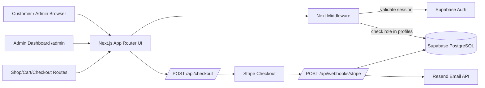

# Bhavnagar Web Application

Professional e-commerce foundation built with Next.js App Router, Supabase, Stripe, and Resend. This repository is structured for fast page delivery, secure role-based admin access, payment processing, and operational notifications.

## Documentation Index

- Technical architecture and implementation: `README.md`
- Application usage guide (customer/admin/operator): `docs/APPLICATION_USER_GUIDE.md`

## Executive Summary

- Runtime: Next.js 16 (App Router, TypeScript, Tailwind CSS)
- Data platform: Supabase (PostgreSQL + Auth)
- Payments: Stripe Checkout + signed webhook handling
- Notifications: Resend transactional email integration
- Deployment target: Vercel (Hobby-compatible)

## Technical Architecture



## Requirement Coverage Matrix

| Requirement | Implementation |
| --- | --- |
| Fast and responsive web application | Next.js App Router SSR/SSG model with Tailwind responsive UI |
| Secure login and role-based access | Supabase Auth session validation + `/admin` role guard in `middleware.ts` |
| Product and order management foundation | Route and API scaffolds for shop/cart/checkout/admin |
| Payment processing | Stripe checkout session API (`/api/checkout`) |
| Payment status updates | Stripe signed webhook endpoint (`/api/webhooks/stripe`) |
| Email notifications | Resend integration triggered on payment confirmation |
| Analytics and reporting | Admin dashboard with sales/product performance scaffolds |
| Low-cost hosting | Vercel-ready deployment model |

## Implemented Modules

- UI routes:
	- `/`
	- `/shop`
	- `/cart`
	- `/checkout`
	- `/account`
	- `/admin` (protected)
- Middleware:
	- Supabase session validation
	- Admin role check using `profiles.role`
- APIs:
	- `POST /api/checkout`
	- `POST /api/webhooks/stripe`
- Integrations:
	- `src/lib/supabase/client.ts` (public client)
	- `src/lib/supabase/admin.ts` (service-role client)
	- `src/lib/payments/stripe.ts`
	- `src/lib/notifications/email.ts`
- Auth UI:
	- `src/components/auth/account-auth-panel.tsx`

## UI/UX Direction

- Professional ecommerce shell with sticky multi-row header and searchable navigation
- Conversion-focused landing page with featured offers and trust signals
- Marketplace-style product cards on `/shop` with ratings and merchandising badges
- Structured cart and checkout experiences with order summary side panels
- Responsive layouts tuned for mobile, tablet, and desktop breakpoints

This front-end is optimized to feel familiar to users of top ecommerce platforms while remaining fully custom and brandable.

## Environment Configuration

Create `.env.local` from `.env.example`:

```bash
NEXT_PUBLIC_SUPABASE_URL=
NEXT_PUBLIC_SUPABASE_ANON_KEY=
SUPABASE_SERVICE_ROLE_KEY=

STRIPE_SECRET_KEY=
NEXT_PUBLIC_STRIPE_PUBLISHABLE_KEY=
STRIPE_WEBHOOK_SECRET=

RESEND_API_KEY=
RESEND_FROM_EMAIL="Bhavnagar <onboarding@resend.dev>"

NEXT_PUBLIC_APP_URL=http://localhost:3000
```

## Database Expectations

This implementation expects these tables/columns in Supabase:

- `profiles`
	- `id` (uuid, matches auth user id)
	- `role` (text, values like `admin` or `customer`)
- `orders`
	- `id`
	- `stripe_session_id` (text)
	- `status` (text)
	- `updated_at` (timestamp)

## Supabase Migration

Baseline migration file is included:

- `supabase/migrations/20260308_init_auth_orders.sql`

What it creates:

- `profiles` table and `orders` table
- auto profile creation trigger on `auth.users`
- `updated_at` maintenance triggers
- RLS policies for own-profile and own-order access

## Local Development

```bash
npm install
npm run dev
```

Default URL: `http://localhost:3000`

## How To Use The Application

For complete feature usage instructions, see `docs/APPLICATION_USER_GUIDE.md`.

Includes:

- Customer journey (shop, account, checkout)
- Admin journey (role-based access, dashboard usage)
- Stripe checkout and webhook testing flow
- Supabase role and table expectations
- Troubleshooting and verification checklist

## Quality Gates

```bash
npm run lint
npm run build
```

Current project status: lint and production build are passing.

## Stripe Webhook Setup (Local)

Example CLI flow:

```bash
stripe listen --forward-to localhost:3000/api/webhooks/stripe
```

Set `STRIPE_WEBHOOK_SECRET` from Stripe CLI output.

## Deployment on Vercel

1. Import repository in Vercel.
2. Configure all environment variables listed above.
3. Ensure Supabase URL/keys and Stripe webhook are set for production.
4. Deploy from main branch.

## Known Implementation Notes

- Admin authorization is enforced through Supabase auth + `profiles.role` lookup.
- Account page now includes live Supabase sign-in/sign-up and sign-out UI.
- Analytics currently use scaffold data and should be switched to SQL aggregates.
- Webhook order update assumes `orders.stripe_session_id` is populated when checkout starts.

## Recommended Next Enhancements

1. Replace mock product/cart data with Supabase-backed entities.
2. Add password reset and email verification UX on the account page.
3. Store checkout metadata so webhook can map sessions to concrete orders/users.
4. Add dashboards driven by real daily/monthly aggregate queries.

